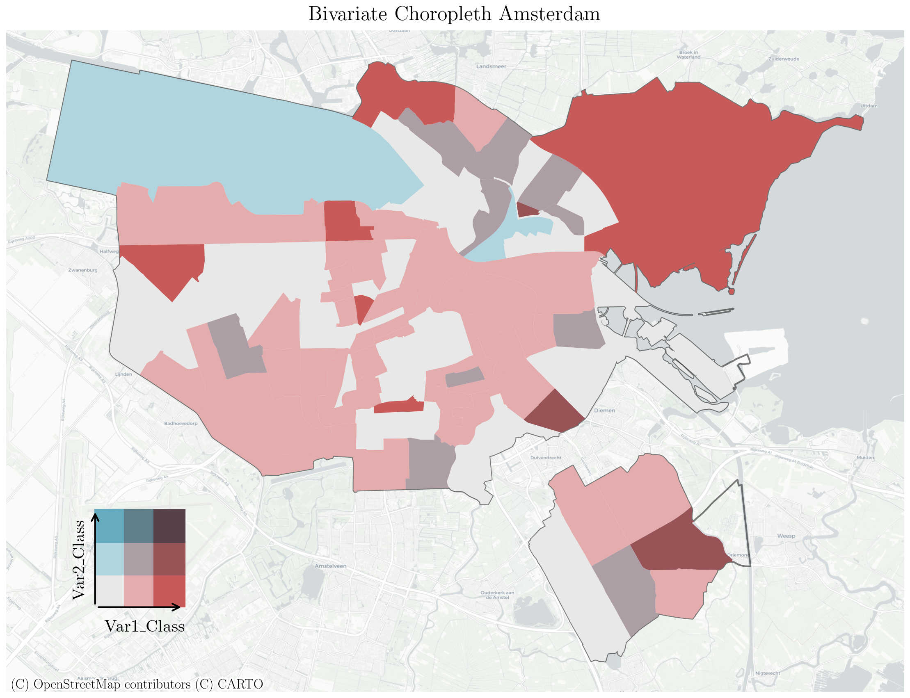

# bivariate-choropleth
How to make bi-variate choropleth with GeoPandas and Matplotlib

## Background
Guess what? Yes, it is a short, *semi-automatic* tutorial on how to make a bivariate choropleth map with **GeoPandas** and **Matplotlib**!

My motivation is simple: I've tried to make such a map in R and QGIS but somehow found it difficult. [This notebook](https://github.com/mikhailsirenko/bivariate-choropleth/blob/main/bivariate-choropleth.ipynb) work in a *plug-in* mode: load your data and execute all cells below. Of course, there are "things" to tweak: colormap, map tiles, etcetera, but I'll point to these lines. Let's go!

## Result

  

